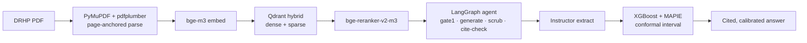

# Phase 06.2: Portfolio Surfaces - Pattern Map

**Mapped:** 2026-08-01
**Files analyzed:** 16 (7 new, 9 modified)
**Analogs found:** 13 / 16 with a concrete in-repo analog (3 are data/docs with test-defined shape)

> This is a **pattern-replication** phase, not greenfield. Every surface has a working
> template on `main`. The dominant risk is *re-implementing* an existing pattern slightly
> differently (a second number formatter, a hand-rolled card, a duplicate CSS injector)
> and drifting from the tested honesty invariant. **Prefer copy-adapt over fresh authorship.**

---

## RESEARCH Verification Notes (analogs checked against live code)

| RESEARCH claim | Live code | Verdict |
|----------------|-----------|---------|
| Card "lifted-depth" hook at `drhplens.css:739` | Line 739 is `[class*="st-key-redflag-field-"]` (a different rule). The real `st-key-drhpcard-*` lifted-card selector is at **`drhplens.css:1351-1374`**. | **CORRECTED** — use 1351-1374. The proposed key `drhpcard-fail-{id}` still matches (prefix `drhpcard-`), so C2 inherits the lift automatically. |
| `.drhp-arch*` already exists at `drhplens.css:1747-1760` | `.drhp-arch` / `.drhp-arch-stage` / `.drhp-arch-arrow` at **1747-1760** | **CONFIRMED** — new C1 hero MUST use different names (e.g. `.drhp-archhero-*`). |
| Google-Fonts `@import` at `drhplens.css:12` | `@import url('https://fonts.googleapis.com/...IBM+Plex...')` at **line 12** | **CONFIRMED** — do not copy into the standalone dashboard. |
| Docling named 3× in `pages/01_methodology.py` at 47 / 55 / 391 | line **47** (`_ARCH` stage 01), line **55** (inside dead `_STAGES_UNUSED`, block spans **53-70**), line **391** (`_STACK` chip) | **CONFIRMED** all three + dead block. Docstring line **7** also says "failure gallery". |
| Footer "Failure gallery" → `/methodology` at `ui/chrome.py:143` | `'<a href="/methodology" target="_self">Failure gallery</a>'` at **line 143** | **CONFIRMED** — repoint to `/failures`. |
| `ui/copy.py` scrubber at 832-836; stub-body "failure gallery" at 166 | scrubber loop **832-836**; `METHODOLOGY_STUB_BODY` **163-170** ("failure gallery" on **166**) | **CONFIRMED**. |
| eval_summary.json numbers | faithfulness `-1.0`, citation `1.0`, recall@{5,10,30} `1.0`, corpus `n_questions=13 / n_scored=11`, `per_ipo={swiggy_2024_11}`, report `2026-07-29-rag-eval.md`, judge `gemini-3.5-flash` | **CONFIRMED** (report date is **07-29**, not 07-28). |
| card_data.json numbers | `coverage=0.8004`, `mae_pts=0.43`, `n_scored=1132`, `gate_passed=false`, `r2=-0.0095`, `seed=false` | **CONFIRMED**. |
| Extraction F1 source (no JSON) | `eval/reports/2026-06-25-extraction-f1.md`: Macro F1 **0.000**, labeled n **7** | **CONFIRMED** — no machine-readable extraction JSON exists; hardcode `0.000` + ref. |
| **`ui/chrome.py` is in scope** | The prompt's "files in scope" list **omits `ui/chrome.py`**, but the footer link repoint (line 143) is a real FAILGAL-01 cleanup obligation. | **FLAG — add `ui/chrome.py` to the modify set** (one-line link repoint). |

---

## File Classification

### New files

| New File | Role | Data Flow | Closest Analog | Match Quality |
|----------|------|-----------|----------------|---------------|
| `ui/failures.py` | component (render module) | file-I/O (read-only) | `ui/eval_inline.py` | **exact** |
| `pages/04_failures.py` | route (Streamlit page shell) | request-response | `pages/03_how_it_works.py` + `pages/02_snapshot.py` | **exact** (shell) |
| `eval/failures/failures.yaml` | config/data (committed fixture) | file-I/O (data source) | `eval/reports/eval_summary.json` (shape-analog only) | no-analog (test-defined schema) |
| `scripts/build_eval_dashboard.py` | utility (generator) | batch/transform (read JSON → write HTML) | `scripts/write_panel_sanity.py` | role-match |
| `tests/unit/test_failures.py` | test | — | `tests/unit/test_eval_inline.py` | **exact** |
| `tests/unit/test_eval_dashboard.py` | test | — | `tests/unit/test_eval_summary_schema.py` (parity) + subprocess build | role-match |
| `tests/unit/test_readme_links.py` | test (link-check) | — | `tests/unit/test_methodology_render.py` (file-existence audits) | partial |

### Modified files

| Modified File | Role | Change | Analog / Reference |
|---------------|------|--------|--------------------|
| `pages/01_methodology.py` | route | add C1 hero; scrub Docling (47/55/391); delete dead `_STAGES_UNUSED` (53-70); add `/failures` link + Swiggy per-IPO; fix docstring (7) | self + UI-SPEC C1 |
| `pages/03_how_it_works.py` | route | remove stale "failure gallery" docstring (line 6) | self |
| `ui/copy.py` | config (copy sink) | add hero/section/status/empty-state chrome strings — must stay scrubber-clean | self (168-170 / scrubber 832-836) |
| `ui/chrome.py` | component (nav/footer) | repoint footer "Failure gallery" link → `/failures` (line 143) | self **[scope flag — see notes]** |
| `app/static/drhplens.css` | config (stylesheet) | **additive only**: `.drhp-fail-*` (C2) + `.drhp-archhero-*` (C1) | existing `.drhp-arch` (1747-1760), `st-key-drhpcard-` (1351-1374), `.drhp-eval-*` |
| `README.md` | config/docs | rewrite (hybrid shape + Mermaid); **keep HF front-matter** (lines 1-11) | self + D-02 Mermaid |
| `pyproject.toml` | config | add `"pyyaml>=6,<7"` to `[project].dependencies` (line 13 block) | self |
| `tests/unit/test_methodology_render.py` | test | extend for LAND-01 (hero present, Docling absent whole-page, `/failures` link, Swiggy-only) | self |

---

## Pattern Assignments

### `ui/failures.py` (component, file-I/O) — the FAILGAL-01 render-only template

**Analog:** `ui/eval_inline.py` (exact posture — copy-adapt).

**Imports + read-only path** (`ui/eval_inline.py:22-33`) — the allowlist to mirror, adding only `yaml`:
```python
from __future__ import annotations
import html
import json                       # keep (or drop if only yaml used)
from pathlib import Path
import streamlit as st
_EVAL_SUMMARY_PATH = (
    Path(__file__).resolve().parents[1] / "eval" / "reports" / "eval_summary.json"
)
```
For failures: `_FAILURES_PATH = Path(__file__).resolve().parents[1] / "eval" / "failures" / "failures.yaml"` and add `import yaml`. Use `yaml.safe_load` (never `yaml.load`).

**`.is_file()` + try/except guard** (`ui/eval_inline.py:88-101`) — the graceful-absence contract; absent/unreadable file renders a single muted `<p>`, never a crash:
```python
if not _EVAL_SUMMARY_PATH.is_file():
    st.markdown(f'<p class="drhp-eval-empty">{html.escape(_EMPTY_FALLBACK)}</p>',
                unsafe_allow_html=True)
    return
try:
    summary = json.loads(_EVAL_SUMMARY_PATH.read_text(encoding="utf-8"))
except Exception:
    st.markdown(f'<p class="drhp-eval-empty">{html.escape(_EMPTY_FALLBACK)}</p>',
                unsafe_allow_html=True)
    return
```
For failures the empty-state copy is UI-SPEC verbatim: heading "No failures loaded.", body "Run the eval suite to populate `eval/failures/failures.yaml`." (put these in `ui/copy.py`, not inline).

**HTML-escape every interpolated value** (`ui/eval_inline.py:108-111`, `66-68`) — the XSS posture (V5 / T-6.1-19). Every failure field (`surface`, `status`, `query`, `expected`, `actual`, `postmortem`) is `html.escape(str(...))` before markup:
```python
def _figure(text: str) -> str:
    return f'<span class="drhp-eval-figure">{html.escape(text)}</span>'
```

**Card chrome via `st.container(border=True, key=...)`** — from `pages/02_snapshot.py:348-354` (the documented lifted-card pattern; a single inner `st.markdown`, never a split `<div>`):
```python
with st.container(border=True, key="drhpcard-financials"):
    st.markdown(f'<h2 class="drhp-snapshot-block-heading">…</h2>', unsafe_allow_html=True)
    render_financials_table(record.fields.get("financials"))
```
For C2 use `key=f"drhpcard-fail-{html.escape(str(e['id']))}"` — the `drhpcard-` prefix is what the lifted-depth selector at `drhplens.css:1351-1374` hooks (see Shared Patterns). One inner `st.markdown` for the whole card body.

---

### `pages/04_failures.py` (route, request-response) — thin page shell → `/failures`

**Analog:** `pages/03_how_it_works.py` (head) + `pages/02_snapshot.py` (import ordering).

**Page-shell head** (`pages/03_how_it_works.py:8-25`) — `set_page_config` MUST be the first Streamlit call; the `# noqa: E402` deferred imports; the non-idempotent css inject; nav; session init:
```python
import streamlit as st
st.set_page_config(page_title="Failures · DRHPLens", page_icon=None,
                   layout="centered", initial_sidebar_state="collapsed")
from app.util.css_loader import load_global_css  # noqa: E402
from ui.chrome import render_nav, render_section_head, render_site_footer  # noqa: E402
from ui.state import init_session_state  # noqa: E402
from ui.failures import render_failures  # noqa: E402
_css_html = load_global_css(st.session_state)
if _css_html:
    st.markdown(_css_html, unsafe_allow_html=True)
init_session_state(st.session_state)
st.markdown(render_nav(), unsafe_allow_html=True)
```
Then the UI-SPEC eyebrow/hero (`FAILURE GALLERY` / "Where it breaks — and what I did about it"), `render_failures()`, and `st.markdown(render_site_footer(), unsafe_allow_html=True)`.

**URL slug:** the `pages/NN_<name>.py` file auto-maps to `/<name>` (numeric prefix + `_` stripped). Verified live: `01_methodology`→`/methodology`, `02_snapshot`→`/snapshot`, `03_how_it_works`→`/how_it_works`. No `st.navigation`/`st.Page` in this app. `04_failures.py` → `/failures` (smoke-check once — RESEARCH A1).

---

### `pages/01_methodology.py` (route, MODIFY) — LAND-01 hero + Docling scrub

**Analog:** self (extend, don't replace). The C1 hero visual contract is UI-SPEC §C1.

**Existing hero block to extend** (`pages/01_methodology.py:33-42`) — the `.drhp-hero2` pattern; the new C1 systems-breadth hero sits at the top using **new** `.drhp-archhero-*` classes:
```python
st.markdown(
    '<div class="drhp-hero2" style="padding:52px 0 36px">'
    '<div class="drhp-glow drhp-glow-a"></div>'
    '<div class="drhp-hero-eyebrow">Methodology</div>'
    '<h1 class="drhp-hero-title">How DRHPLens<br>keeps itself honest.</h1>' …
```

**Docling scrub — three exact sites (whole-page scope, per RESEARCH Open-Q #1 / A4):**
- **Line 47** — `_ARCH` stage 01: `("01", "Parse", "Docling · layout-aware · page-anchored chunks")`. RESEARCH recommendation: **replace the whole 5-stage `.drhp-arch` diagram (46-76) with the C1 hero** (they are redundant); or rewrite stage 01 to `"PyMuPDF + pdfplumber · page-anchored"`.
- **Lines 53-70** — dead `_STAGES_UNUSED` (line 55 names Docling): **delete** (unused).
- **Line 391** — `_STACK` chip list contains `"Docling"`: drop the chip (keep LangGraph/LlamaIndex/bge/Qdrant/Instructor/MAPIE/etc.).
- **Line 7** — docstring "…and the failure gallery in": refresh (gallery now exists at `/failures`).

**Per-IPO honesty guard — copy the tested behavior** (`ui/eval_inline.py:148`): a per-IPO line renders ONLY when the id is present in `per_ipo` (committed `eval_summary.json` has `swiggy_2024_11` only):
```python
if drhp_id in per_ipo:   # never fabricate a per-IPO number
    entry = per_ipo[drhp_id] or {}
```

**Live-eval read guard already on the page** (`pages/01_methodology.py:104-114`) — reuse this exact `.is_file()`+try/except for any new committed read; do NOT add a second reader.

---

### `scripts/build_eval_dashboard.py` (utility, batch/transform) — OPS-03a generator

**Analog:** `scripts/write_panel_sanity.py` (reads committed artifact → writes committed artifact, deterministic, no network).

**Generator skeleton** (`scripts/write_panel_sanity.py:14-41`):
```python
from __future__ import annotations
import json
from pathlib import Path
_REPO = Path(__file__).resolve().parents[1]
_OUT = _REPO / "eval" / "dashboards" / "eval-dashboard.html"   # (adapt path)
def main() -> None:
    # read committed JSON, build HTML, write once
    _OUT.write_text(html_str, encoding="utf-8")
if __name__ == "__main__":
    main()
```

**Data sources (verified, machine-readable):**
- RAG → `eval/reports/eval_summary.json` `aggregate`: `citation_accuracy=1.0`, `recall_at_{5,10,30}=1.0`, `faithfulness_deepeval=-1.0` → render verbatim **"not measured"** (never `-1.00`/`0.00`). Reuse the sentinel logic from `ui/eval_inline.py:52-63` (`_faithfulness_display`).
- Forecast → `model_card/card_data.json`: `coverage=0.8004`, `mae_pts=0.43`, `n_scored=1132`, `gate_passed=false` (honest "does not beat baseline"), `r2=-0.0095`. Plus **base64-inline** `model_card/calibration.png` (43 KB) as `data:image/png;base64,…`.
- Extraction → **no machine-readable JSON exists**; hardcode `F1 = 0.000` with an inline `refs:` to `eval/reports/2026-06-25-extraction-f1.md` (Macro F1 0.000, n=7 labeled). Assert that literal in the parity test.

**Self-contained mandate (Pitfall 3):** author a fresh inline `<style>` with font *fallbacks only* (`font-family: 'IBM Plex Mono', ui-monospace, monospace;`) — **no `@import`**. Mirror `:root` tokens by value (UI-SPEC C3). Zero `http(s)://` asset URLs.

---

### `README.md` (config/docs, MODIFY) — OPS-03b portfolio rewrite

**Analog:** self. Current README is a 52-line Phase-1 stub.

**Keep the HF Spaces front-matter verbatim** (`README.md:1-11`) — the deploy depends on it:
```yaml
---
title: DRHPLens
emoji: 📄
sdk: streamlit
sdk_version: 1.36.0
app_file: app.py
license: mit
sleep_time: 1800
---
```

**Mermaid diagram (D-02)** — a ` ```mermaid ` fenced block depicting the REAL pipeline (Docling **absent**); quote node labels containing `(`/`+`/`·`:


**Cross-links (repo-relative):** `model_card/MODEL_CARD.md`, `eval/dashboards/eval-dashboard.html`, `/methodology`, `/failures` (+ `eval/failures/failures.yaml`), and the live-demo placeholder "Live demo — coming with the public deploy (Phase 6.3)."

---

## Test Pattern Assignments

### `tests/unit/test_failures.py` — mirror `tests/unit/test_eval_inline.py`

**`_RecordingSt` render stub** (`test_eval_inline.py:47-54`) — extend `.container()` to a `nullcontext` for the `st.container(border=True, key=…)` card:
```python
class _RecordingSt:
    def __init__(self): self.emitted = []
    def markdown(self, body, unsafe_allow_html=False): self.emitted.append(body)
    # ADD for failures:
    def container(self, *a, **k):
        import contextlib
        return contextlib.nullcontext()
```

**Render harness** (`test_eval_inline.py:80-87`) — monkeypatch the module path + `st`, join emitted, assert:
```python
monkeypatch.setattr(eval_inline, "_EVAL_SUMMARY_PATH", path)
monkeypatch.setattr(eval_inline, "st", _RecordingSt())
```

**AST import-isolation** (`test_eval_inline.py:91-120`) — copy verbatim; extend the allowlist with `yaml`:
```python
allowed_imports = {"__future__", "html", "json", "pathlib", "yaml", "streamlit"}
# forbidden token scan: "openai","genai","instructor","groq","qdrant",".invoke(",
#   "langgraph","llama_index","from deepeval","import deepeval"
```

**Value-invariant styling** (`test_eval_inline.py:124-129` + class-allowlist scan at `199-212` incl. `re.findall(r'class="([^"]*)"', out)` at line **206**) — assert only `.drhp-fail-*` classes appear, no `style=`, no color/badge/emoji, and an `open` vs `mitigated` entry render byte-identically except the status text.

**Schema + count gate (FAILGAL-01) — new to this file** (RESEARCH §Code Examples): `len(entries) >= 10`, required keys `{id,surface,category,query,expected,actual,postmortem,status,refs}`, `surface ∈ {rag,extraction,forecast}` (all three present), `status ∈ {open,mitigated}`, non-empty `postmortem`, unique `id`.

### `tests/unit/test_eval_dashboard.py` — parity + build + self-contained

**Parity keyed to committed JSON** (analog `tests/unit/test_eval_summary_schema.py` reads the pinned artifacts; here re-derive and assert-verbatim):
```python
subprocess.run([sys.executable, "scripts/build_eval_dashboard.py"], check=True)
html = Path("eval/dashboards/eval-dashboard.html").read_text("utf-8")
assert not re.search(r'(src|href)\s*=\s*["\']https?://', html)   # self-contained
assert "1.000" in html or "1.00" in html                          # citation / recall
assert "not measured" in html                                     # faithfulness -1, verbatim
assert "-1.0" not in html                                         # never a fake faithfulness
assert "0.80" in html                                             # coverage 0.8004
assert "data:image/png;base64," in html                           # calibration.png inlined
```
Assert each headline number **independently** (one combined assertion would mask a single drifted figure).

### `tests/unit/test_readme_links.py` — link-check (partial analog)

**Analog:** the file-existence audits in `tests/unit/test_methodology_render.py:111-118` (`p.is_file() and p.stat().st_size > 0`). Parse repo-relative links out of `README.md` and assert each referenced committed file exists (`model_card/MODEL_CARD.md`, `eval/dashboards/eval-dashboard.html`, `eval/failures/failures.yaml`).

### `tests/unit/test_methodology_render.py` — EXTEND for LAND-01

Existing tests read `PAGE.read_text()` (whole-page source audit, `:28-34`). Add: hero renders (new `.drhp-archhero-*`), `"PyMuPDF"`/`"Qdrant"`/`"LangGraph"`/`"MAPIE"` present, **`"Docling"` absent (whole-page)**, `/failures` link present, per-IPO shows only Swiggy.

---

## Shared Patterns

### Render-only isolation (P19 / AST-allowlist)
**Source:** `ui/eval_inline.py:22-28` (imports) pinned by `tests/unit/test_eval_inline.py:91-120`.
**Apply to:** `ui/failures.py` (allowlist `{__future__, html, json, pathlib, yaml, streamlit}`), and the extended `pages/01_methodology.py` source-audit.
No render path may import the agent/LLM/vector/model pipeline — the AST tests are the primary demo-safe control.

### HTML-escape before `unsafe_allow_html` (V5 / T-6.1-19)
**Source:** `ui/eval_inline.py:66-68, 108-111`.
**Apply to:** every interpolated value in `ui/failures.py`, the C1 hero, and the dashboard-inlined text.
```python
f'<span class="drhp-eval-figure">{html.escape(text)}</span>'
```

### Lifted-depth card hook (the C2 chrome)
**Source:** `app/static/drhplens.css:1351-1374` (`[class*="st-key-drhpcard-"]`) + call-site `pages/02_snapshot.py:348-354`.
**Apply to:** the C2 failure card via `st.container(border=True, key="drhpcard-fail-{id}")` — the `drhpcard-` prefix inherits the ambient shadow + bevel automatically; add only the `.drhp-fail-*` inner styling.
```css
[class*="st-key-drhpcard-"] {
  border-radius: 12px !important;
  box-shadow: 0 1px 2px rgba(0,0,0,.45), 0 16px 32px -20px rgba(0,0,0,.80) !important;
  margin-bottom: var(--drhp-space-xl) !important;
}
```
> **NB:** RESEARCH cited this at `:739` — that line is a different rule. Use **1351-1374**.

### Single CSS injection point (FLAG-2)
**Source:** `app/util/css_loader.py:30-47` (`load_global_css`) — non-idempotent, re-emitted every run.
**Apply to:** all new CSS. Add rules to `app/static/drhplens.css` (additive: `.drhp-fail-*`, `.drhp-archhero-*` — **never** `.drhp-arch*`, taken at 1747-1760) and reference by class. Never inject a `<style>` from a page. The standalone dashboard is the ONE exception (self-contained inline `<style>`, no `@import`).

### Copy sink + import-time scrubber (Pitfall 4)
**Source:** `ui/copy.py:809-836` (the `_scrub_sample_substituted` loop asserts on banned stems at import; precedent: "Buyer" tripped the `buy` stem).
**Apply to:** only the *chrome* strings (section eyebrow, empty-state, per-IPO caption, live-demo placeholder) go in `ui/copy.py`, kept UI-SPEC-verbatim (already scrubber-clean). **Failure entry content lives in `failures.yaml`, which is NOT scrubbed** — correct, because failures describe real behavior with evaluative words. Run the module import after any copy edit.

### "not measured" sentinel + em-dash formatting
**Source:** `ui/eval_inline.py:43-63` (`_eval_num`, `_faithfulness_display`).
**Apply to:** the dashboard's RAG section and any methodology eval cell. `faithfulness_deepeval == -1.0` → "not measured"; NaN/None → "—"; never `0.00` as a guess. Do NOT write a second formatter.

### Generator: read committed → write committed (deterministic, no network)
**Source:** `scripts/write_panel_sanity.py:14-41`.
**Apply to:** `scripts/build_eval_dashboard.py` — `_REPO = Path(__file__).resolve().parents[1]`, `main()` + `if __name__ == "__main__"`, `_OUT.write_text(..., encoding="utf-8")`. Re-runnable, reproduces byte-identical output over the same committed artifacts.

---

## No / Partial Analog

| File | Role | Data Flow | Note |
|------|------|-----------|------|
| `eval/failures/failures.yaml` | data fixture | file-I/O | No YAML data file exists in-repo (first `import yaml` too). Shape is defined entirely by the schema+count test; author ≥10 entries from RESEARCH §"Real Failure Sourcing" (12 candidates with committed `refs`). `eval_summary.json` is the closest *shape* precedent but is JSON. |
| `tests/unit/test_readme_links.py` | test | — | Only a *partial* analog (file-existence audits in `test_methodology_render.py:111-118`); the link-parsing half is new. |
| `pyproject.toml` (pyyaml decl) | config | — | Trivial one-line add to `[project].dependencies` (block starts line 13); no code analog needed. |

---

## Metadata

**Analog search scope:** `ui/`, `pages/`, `scripts/`, `tests/unit/`, `app/static/`, `app/util/`, `eval/reports/`, `model_card/`, repo root (`README.md`, `pyproject.toml`).
**Files scanned (read/grepped):** `ui/eval_inline.py`, `tests/unit/test_eval_inline.py`, `pages/03_how_it_works.py`, `pages/02_snapshot.py`, `pages/01_methodology.py`, `app/util/css_loader.py`, `app/static/drhplens.css` (targeted), `ui/chrome.py` (targeted), `ui/copy.py` (targeted), `tests/unit/test_methodology_render.py`, `tests/unit/test_eval_summary_schema.py`, `scripts/write_panel_sanity.py`, `scripts/regenerate_model_card.py`, `eval/reports/eval_summary.json`, `model_card/card_data.json`, `eval/reports/2026-06-25-extraction-f1.md`, `README.md`, `pyproject.toml`.
**Pattern extraction date:** 2026-08-01
