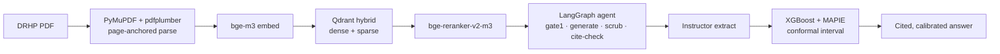

# Phase 6.2: Portfolio Surfaces - Research

**Researched:** 2026-08-01
**Domain:** Streamlit render-only surfaces + committed-artifact rendering (no new problem domain — this is a repo-pattern-replication phase)
**Confidence:** HIGH (every mechanic below is verified against the actual repo, not inferred)

<user_constraints>
## User Constraints (from CONTEXT.md)

### Locked Decisions
- **D-01 (README shape):** README uses a **hybrid shape** — scannable top (recruiter hook + headline metrics + architecture diagram) readable in ~30s, then deeper sections (methodology narrative, evals, honest limitations), ending with links to `/methodology`, the committed dashboard, the model card, and `/failures`.
- **D-02 (README diagram):** The README architecture diagram is a **Mermaid fenced code block** (GitHub renders it natively) — text-based, zero external asset, honesty-invariant. It depicts the REAL pipeline (PyMuPDF + pdfplumber → bge-m3 → Qdrant hybrid → bge-reranker → LangGraph agent → Instructor → XGBoost + MAPIE → cited answer; **NOT Docling**). Three render targets, one pipeline: README = Mermaid, `/methodology` = UI-SPEC **C1** HTML/CSS hero, dashboard = inline HTML.
- **D-03 (dashboard):** The committed HTML dashboard is **sectioned by surface** — three sections: **RAG** (recall@k, citation, faithfulness verbatim "not measured"), **Extraction** (F1), **Forecast** (conformal coverage + calibration plot) — with the honest **Swiggy-only per-IPO caveat inline**. One self-contained file (inline CSS + inlined plot images, zero external/CDN URLs).
- **D-04 (screenshots):** **No app screenshots this phase.** 6.2 surfaces stay entirely text/metrics-based; live UI ships with Phase 6.3 (OPS-02).

### Claude's Discretion
- **Failure gallery count & ref rigor (FAILGAL-01):** target ≥10 (ideally 12–15), balanced so every top-level `surface` ∈ {rag, extraction, forecast} appears ≥1×; prefer citing a verifiable `refs` path per entry. Not a hard gate beyond the SPEC's schema+count test.
- Standard implementation details (file layout beyond SPEC's named paths, test structure, Mermaid node phrasing, dashboard section ordering) are the planner's/executor's call, consistent with the locked docs.

### Deferred Ideas (OUT OF SCOPE)
- **App screenshots of the live UI** → Phase 6.3 (D-04).
- **Live-from-Langfuse failure feed** → rejected for demo-safety; failures stay curated/committed.
- **OPS-02 public deploy + the four disclosed 6.1 follow-ups** (judge calibration, CI gate lane, gold-set span-tightening, WR-03) → Phase 6.3 (launch gate).
</user_constraints>

<phase_requirements>
## Phase Requirements

| ID | Description | Research Support |
|----|-------------|------------------|
| **FAILGAL-01** | `/failures` gallery: ≥10 real failures from a committed data file, render-only | Mirror `ui/eval_inline.py` + `tests/unit/test_eval_inline.py`. New `pages/04_failures.py` (→ `/failures`), `ui/failures.py::render_failures()`, `eval/failures/failures.yaml`. Real failure refs mapped below (§Real Failure Sourcing). |
| **LAND-01** | `/methodology` recruiter extension: hero + honest architecture diagram + `/failures` link + Swiggy-only per-IPO summary | Extend `pages/01_methodology.py`. **CRITICAL:** page currently names "Docling" 3× (must be removed — see Pitfall 1). New C1 hero classes must not collide with the existing `.drhp-arch-*` (Pitfall 2). |
| **OPS-03a** | Committed self-contained HTML eval dashboard + generator | New `scripts/build_eval_dashboard.py` → `eval/dashboards/eval-dashboard.html`. Sources: `eval_summary.json` (RAG), `model_card/card_data.json` (forecast), extraction report (F1). Base64-inline `calibration.png`. **No Google-Fonts `@import`** (Pitfall 3). |
| **OPS-03b** | Portfolio README with cross-links | Rewrite `README.md` (currently a thin Phase-1 stub). Keep the HF Spaces YAML front-matter. Mermaid diagram per D-02. Repo-relative links; link-check test. |
| **EVAL-04** | "Show your work" pane | **ALREADY DELIVERED** by METHOD-01 (Phase 3): `ui/methodology_pane.py` + `tests/unit/test_methodology_pane.py`. Reused, NOT rebuilt. No task should touch it beyond confirming coverage. |
</phase_requirements>

## Summary

This is not a greenfield phase — it is a **pattern-replication + honest-content-authoring** phase. Every surface has a working template already in the repo. `ui/eval_inline.py` (render-only figure) + `tests/unit/test_eval_inline.py` (AST-import-allowlist isolation + `_RecordingSt` stub) are the exact blueprint for `ui/failures.py` and its test. The `.drhp-*` design system, the `load_global_css` injection path, the `st.container(border=True, key=...)` "lifted card" hook (CSS targets `[class*="st-key-…"]`, verified at `drhplens.css:739`), and the committed artifacts (`eval_summary.json`, `card_data.json`, `calibration.png`) all exist. The planner's job is to wire four new files and rewrite the README — not to invent architecture.

The dominant risk is **honesty-invariant regression on the existing `/methodology` page**, not new-surface complexity. `pages/01_methodology.py` today names **"Docling" in three places** (the `.drhp-arch` stage list at line 47, the dead `_STAGES_UNUSED` at line 55, and the `_STACK` chips at line 391). LAND-01's acceptance test asserts **"Docling" absent**. Whether that assertion is hero-scoped or whole-page-scoped is the single highest-leverage planning decision (see Open Questions). Independently, the new C1 hero **cannot** reuse `.drhp-arch` / `.drhp-arch-stage` / `.drhp-arch-arrow` — those classes already exist and style the current (soon-stale) 5-stage flow; the UI-SPEC's "additive `.drhp-arch-*`" mandate must resolve to genuinely new class names.

**Primary recommendation:** Treat `ui/eval_inline.py`/`test_eval_inline.py` as a literal copy-adapt template (add `yaml` to the allowlist). Declare **`pyyaml` as an explicit dependency** — it is currently only transitively present (Pitfall 5). Resolve the Docling references on `/methodology` in the same plan slice that adds the C1 hero. Build the dashboard with a numeric-parity test keyed to `eval_summary.json` + `card_data.json` so committed numbers can never silently diverge.

## Architectural Responsibility Map

| Capability | Primary Tier | Secondary Tier | Rationale |
|------------|-------------|----------------|-----------|
| `/failures` gallery render | Frontend Server (Streamlit page) | Database/Storage (committed `failures.yaml`) | Streamlit multipage script reads a committed file at render; no live tier involved (P19 demo-safe). |
| `/methodology` hero + diagram | Frontend Server (Streamlit page) | — | Static HTML/CSS emitted via `st.markdown(unsafe_allow_html=True)`; no data fetch. |
| Per-IPO eval summary | Frontend Server | Database/Storage (`eval_summary.json`) | Already implemented by `ui/eval_inline.py` posture; reuse the same read-only guard. |
| Committed HTML dashboard | Build script (`scripts/`) | Database/Storage (`eval_summary.json`, `card_data.json`, `calibration.png`) | A generator runs offline and commits a static artifact; renders with zero runtime tier (opens as `file://`). |
| README | Static / repo docs | CDN/Static (GitHub Mermaid renderer) | Markdown + Mermaid rendered by GitHub; no app tier. |

**No capability in this phase belongs to the API/agent tier.** Any import of the agent/LLM/vector/model pipeline into a render path is an isolation breach the AST tests must catch.

## Standard Stack

### Core
| Library | Version | Purpose | Why Standard |
|---------|---------|---------|--------------|
| Python stdlib `html` | 3.11 | `html.escape()` every interpolated failure string | Exact XSS posture of `ui/eval_inline.py` (T-6.1-19). `[VERIFIED: repo grep — ui/eval_inline.py uses html.escape throughout]` |
| Python stdlib `json` | 3.11 | Read `eval_summary.json`, `card_data.json` for the dashboard | Existing render-only reads use `json.loads(path.read_text())`. `[VERIFIED: repo]` |
| Python stdlib `pathlib` | 3.11 | `Path(__file__).resolve().parents[N]` artifact paths | Established pattern (`_EVAL_SUMMARY_PATH`). `[VERIFIED: repo]` |
| Python stdlib `base64` | 3.11 | Inline `calibration.png` as a `data:image/png;base64,…` URI in the dashboard | The only zero-external-asset way to embed a raster in a self-contained HTML file. `[ASSUMED — standard technique]` |
| `PyYAML` (`yaml`) | 6.0.3 (installed) | Parse `eval/failures/failures.yaml` | The locked data format (SPEC names `.yaml`; AST allowlist names `yaml`). **Currently only a transitive dep — must be declared.** `[VERIFIED: .venv/bin/pip show pyyaml → 6.0.3]` |
| `streamlit` | 1.57.0 (installed; `>=1.36` declared) | Page + render primitives; `st.container(border=True, key=…)`, `st.markdown(unsafe_allow_html=True)`, `st.image` | The app framework; multipage via `pages/` auto-discovery. `[VERIFIED: .venv → 1.57.0]` |
| `pytest` | 9.0.3 (installed; `>=8` declared) | All new tests | `[VERIFIED: .venv → 9.0.3]` |

### Supporting
| Library | Version | Purpose | When to Use |
|---------|---------|---------|-------------|
| stdlib `ast` + `inspect` | 3.11 | Import-allowlist isolation test for `ui/failures.py` | Copy `tests/unit/test_eval_inline.py::test_read_only_isolation_no_llm_import` verbatim, adding `yaml` to `allowed_imports`. `[VERIFIED: repo]` |
| stdlib `re` | 3.11 | Verdict-class allowlist scan in render tests | Pattern at `test_eval_inline.py:206` (`re.findall(r'class="([^"]*)"', out)`). `[VERIFIED: repo]` |

### Alternatives Considered
| Instead of | Could Use | Tradeoff |
|------------|-----------|----------|
| `failures.yaml` (PyYAML) | `failures.json` (stdlib, already used by `eval_summary.json`) | JSON needs **zero new dependency** and matches the existing render-only reads exactly. **But** SPEC + CONTEXT + AST-allowlist all name YAML explicitly → YAML is the locked choice; declaring `pyyaml` is the correct resolution, not switching to JSON. Flagged in Open Questions only for the planner's awareness. |
| Base64-inline `calibration.png` | Regenerate the plot as inline SVG | SVG survives the Streamlit sanitizer and is smaller, but the committed asset is a PNG (43 KB) and Phase 5 owns plot generation; re-plotting is scope creep. Base64 PNG keeps the dashboard a pure render of committed artifacts. |

**Installation:** No new third-party install if `pyyaml` is added to `pyproject.toml [project].dependencies`:
```bash
# Add to pyproject.toml: "pyyaml>=6,<7"   then:
uv pip install -e ".[dev]"   # re-resolves; pyyaml 6.0.3 already present transitively
```

**Version verification (run):**
```
.venv/bin/pip show pyyaml  → Name: PyYAML  Version: 6.0.3  (Required-by: docling-core, transformers, langchain-core, …)
.venv/bin/python -c "import streamlit,yaml,pytest" → streamlit 1.57.0 · yaml 6.0.3 · pytest 9.0.3
```

## Package Legitimacy Audit

> This phase installs **no new package**. `pyyaml` must be *declared*, but it is already resolved into the venv transitively — no new download.

| Package | Registry | Age | Downloads | Source Repo | slopcheck | Disposition |
|---------|----------|-----|-----------|-------------|-----------|-------------|
| PyYAML | PyPI | 18+ yrs | ~300M/wk | github.com/yaml/pyyaml | not run (offline) — but canonical, already installed 6.0.3, pulled by 10+ existing deps | **Approved — declare explicitly** |

**Packages removed due to slopcheck [SLOP] verdict:** none.
**Packages flagged as suspicious [SUS]:** none.

*slopcheck was not run (no network guarantee in-session); PyYAML needs no legitimacy gate — it is the reference YAML library, already present via `docling-core`/`transformers`/`langchain-core`/`mlflow-skinny`/`omegaconf`/`peft`/`huggingface_hub`. The only action is a one-line dependency declaration so the failures page never breaks if a transitive parent is pruned.*

## Architecture Patterns

### System Architecture Diagram (data flow for the three surfaces)

```
                          COMMITTED ARTIFACTS (read-only, on main)
   eval/failures/failures.yaml   eval/reports/eval_summary.json   model_card/card_data.json
             │                              │                              │  + calibration.png
             │                              │                              │
   ┌─────────▼─────────┐        ┌───────────▼───────────┐      ┌───────────▼──────────────┐
   │ ui/failures.py    │        │ ui/eval_inline.py     │      │ scripts/build_eval_       │
   │ render_failures() │        │ (EXISTS — reused on   │      │   dashboard.py (NEW)      │
   │ • .is_file()+try  │        │  /methodology)        │      │ • json.load × N          │
   │ • yaml.safe_load  │        │ • json.load           │      │ • base64 PNG inline      │
   │ • html.escape ALL │        │ • html.escape         │      │ • inline <style> (NO     │
   └─────────┬─────────┘        └───────────┬───────────┘      │   @import fonts)         │
             │                              │                  └───────────┬──────────────┘
   ┌─────────▼─────────┐        ┌───────────▼───────────┐                  │ writes (committed)
   │ pages/04_failures │        │ pages/01_methodology  │      ┌───────────▼──────────────┐
   │ .py  → /failures  │        │ .py → /methodology    │      │ eval/dashboards/          │
   │ (Streamlit page)  │        │ + C1 hero + /failures │      │ eval-dashboard.html       │
   └─────────┬─────────┘        │   link + per-IPO sum. │      │ (opens file:// offline)   │
             │                  └───────────┬───────────┘      └───────────┬──────────────┘
             │                              │                              │
        ┌────▼──────────────────────────────▼───────────┐        ┌─────────▼─────────┐
        │  st.markdown(unsafe_allow_html=True)           │        │  README.md links  │
        │  → Streamlit sanitizer → recruiter's browser   │        │  (repo-relative)  │
        └────────────────────────────────────────────────┘        └───────────────────┘

   NO ARROW crosses into the agent / LLM / Qdrant / model pipeline. AST tests enforce this.
```

### Recommended Project Structure (new/changed files)
```
pages/
  04_failures.py         # NEW — thin page shell (set_page_config → css → nav → render_failures → footer)
ui/
  failures.py            # NEW — render_failures(); mirror of ui/eval_inline.py (allowlist: yaml/json/pathlib/html/streamlit)
  copy.py                # EXTEND — hero/section/status/empty-state strings (scrubber-checked at import — Pitfall 4)
  chrome.py              # EDIT — render_nav() / render_site_footer(): repoint "Failure gallery" link to /failures (line 143)
eval/
  failures/failures.yaml # NEW — ≥10 real entries; committed data
  dashboards/eval-dashboard.html  # NEW — committed generator output
scripts/
  build_eval_dashboard.py         # NEW — generator (json + base64, no external URL)
pages/01_methodology.py           # EDIT — add C1 hero + /failures link + per-IPO summary; REMOVE Docling refs (Pitfall 1)
pages/03_how_it_works.py          # EDIT — remove stale "failure gallery" docstring ref (line 6)
app/static/drhplens.css           # EXTEND — additive .drhp-fail-* + new C1 hero classes (NOT .drhp-arch-* — Pitfall 2)
README.md                         # REWRITE — keep HF front-matter; hybrid shape + Mermaid diagram
tests/unit/
  test_failures.py                # NEW — schema+count, AST-isolation, render (mirror test_eval_inline.py)
  test_methodology_render.py      # EXTEND — hero present, Docling absent, /failures link, Swiggy-only per-IPO
  test_eval_dashboard.py          # NEW — build + self-contained + numeric parity + link-check
```

### Pattern 1: Render-only module (the FAILGAL-01 template)
**What:** A `ui/` module that reads exactly one committed file behind `.is_file()` + `try/except`, HTML-escapes every interpolated value, emits single-element `st.markdown` blocks, and imports nothing outside a stdlib+streamlit allowlist.
**When to use:** `ui/failures.py::render_failures()` — verbatim posture of `ui/eval_inline.py`.
**Example (skeleton — adapt from `ui/eval_inline.py:81-157`):**
```python
# ui/failures.py — mirror of ui/eval_inline.py posture (render-only, P19)
from __future__ import annotations
import html
from pathlib import Path
import yaml            # the ONLY addition to the eval_inline allowlist
import streamlit as st

_FAILURES_PATH = Path(__file__).resolve().parents[1] / "eval" / "failures" / "failures.yaml"
_EMPTY_HEADING = "No failures loaded."   # UI-SPEC empty-state copy
_EMPTY_BODY = "Run the eval suite to populate `eval/failures/failures.yaml`."

def render_failures() -> None:
    if not _FAILURES_PATH.is_file():
        st.markdown(f'<p class="drhp-fail-empty">{html.escape(_EMPTY_HEADING)}</p>',
                    unsafe_allow_html=True)
        return
    try:
        entries = yaml.safe_load(_FAILURES_PATH.read_text(encoding="utf-8")) or []
    except Exception:
        st.markdown(f'<p class="drhp-fail-empty">{html.escape(_EMPTY_HEADING)}</p>',
                    unsafe_allow_html=True)
        return
    for e in entries:
        # st.container(border=True, key=…) is the "lifted card" hook; CSS targets
        # [class*="st-key-drhpcard-fail-"] (see drhplens.css:739 for the precedent).
        with st.container(border=True, key=f"drhpcard-fail-{html.escape(str(e.get('id','')))}"):
            surface = html.escape(str(e.get("surface", "")))
            status = html.escape(str(e.get("status", "")))   # open|mitigated — NEVER colored
            title  = html.escape(str(e.get("query", "")))
            expected = html.escape(str(e.get("expected", "")))
            actual   = html.escape(str(e.get("actual", "")))
            postmortem = html.escape(str(e.get("postmortem", "")))
            st.markdown(f'<div class="drhp-fail-card">…{surface}…{status}…{title}…'
                        f'{expected}…{actual}…{postmortem}…</div>', unsafe_allow_html=True)
```
*Note: `yaml.safe_load` (never `yaml.load`) — the render must never execute arbitrary tags from a data file.*

### Pattern 2: Thin page shell (Streamlit multipage → URL)
**What:** `pages/NN_<name>.py` auto-maps to `/<name>` (numeric prefix + underscore stripped). Every page opens with `st.set_page_config(...)` **first**, then `load_global_css`, `render_nav`, `init_session_state`.
**When to use:** `pages/04_failures.py` → `/failures`. Verified: `01_methodology.py`→`/methodology`, `02_snapshot.py`→`/snapshot`, `03_how_it_works.py`→`/how_it_works`. This is the classic `pages/` directory pattern — the app uses **no** `st.navigation`/`st.Page` (verified: `grep` found none in `app.py`/`pages/`).
**Example (copy the head of `pages/03_how_it_works.py:1-25`):**
```python
import streamlit as st
st.set_page_config(page_title="Failures · DRHPLens", page_icon=None,
                   layout="centered", initial_sidebar_state="collapsed")
from app.util.css_loader import load_global_css   # noqa: E402
from ui.chrome import render_nav, render_section_head, render_site_footer  # noqa: E402
from ui.state import init_session_state            # noqa: E402
from ui.failures import render_failures            # noqa: E402
_css = load_global_css(st.session_state)
if _css: st.markdown(_css, unsafe_allow_html=True)
init_session_state(st.session_state)
st.markdown(render_nav(), unsafe_allow_html=True)
# … hero/eyebrow (UI-SPEC "FAILURE GALLERY" / "Where it breaks…") …
render_failures()
st.markdown(render_site_footer(), unsafe_allow_html=True)
```

### Pattern 3: Self-contained committed dashboard (OPS-03a)
**What:** A build script reads committed JSON, inlines everything, writes one HTML file with **zero `http(s)://` asset URLs**, and commits it. The parity test re-derives the numbers from `eval_summary.json`/`card_data.json` and asserts they appear verbatim (so the committed HTML can never drift from the committed metrics).
**When to use:** `scripts/build_eval_dashboard.py`.
**Data sources (verified machine-readable):**
- RAG → `eval/reports/eval_summary.json`: `citation_accuracy=1.0`, `recall_at_{5,10,30}=1.0`, `faithfulness_deepeval=-1.0` (→ render verbatim **"not measured"**, never `-1.00`/`0.00`).
- Forecast → `model_card/card_data.json`: `coverage=0.8004`, `mae_pts=0.43`, `n_scored=1132`, `gate_passed=False` (→ honest "does not beat baseline"), `r2=-0.0095`. Plus base64 `model_card/calibration.png`.
- Extraction → `eval/reports/2026-06-25-extraction-f1.md`: Macro F1 `0.000` (n=7 labeled, 0 scored). **No committed machine-readable extraction JSON exists** (see Open Questions).

### Pattern 4: Mermaid in the README (D-02)
**What:** A ` ```mermaid ` fenced block. GitHub renders it natively (since Feb 2022) across READMEs; auto-adapts to light/dark via `prefers-color-scheme`. `[CITED: docs.github.com/.../creating-diagrams + github.blog]`
**Gotchas:** fence language must be exactly `mermaid`; keep node labels free of unescaped `(`/`)`/`:`/`;` inside `[]` (wrap in quotes, e.g. `A["PyMuPDF + pdfplumber"]`). Zero external assets — it is text.
**Example:**


### Anti-Patterns to Avoid
- **Splitting a card into multiple `st.markdown` divs** — the repo's documented "Phase 3 white-bar lesson" (`drhplens.css:1004`): a bare `<div>` split gets mangled by the sanitizer. Use `st.container(border=True)` for card chrome and a single inner `st.markdown`.
- **`unsafe_allow_html=True` without `html.escape` on data** — every failure string is author-controlled today but is still data; escape it (V5 / T-6.1-19).
- **Reusing `.drhp-arch*` for the new hero** — those classes already exist; see Pitfall 2.
- **A Google-Fonts `@import` in the dashboard** — the app CSS has one (`drhplens.css:12`); copying it into the standalone file breaks "no external URL" (Pitfall 3).
- **`yaml.load` instead of `yaml.safe_load`** — arbitrary-tag execution on a data file.

## Don't Hand-Roll

| Problem | Don't Build | Use Instead | Why |
|---------|-------------|-------------|-----|
| Failures data read | Custom parser / regex over a markdown table | `yaml.safe_load` over `failures.yaml` | Structured, schema-testable, matches the AST allowlist. |
| Card chrome / lifted depth | A hand-split `<div class="card">…</div>` | `st.container(border=True, key="drhpcard-fail-{id}")` + `[class*="st-key-…"]` CSS | Sanitizer-safe; the documented Phase-3/4/5 card pattern. |
| Architecture diagram (README) | ASCII art / committed PNG / external image | ` ```mermaid ` fenced block | Zero asset, honesty-maintainable, GitHub-native. |
| Diagram (in-app) | New bespoke flow component | UI-SPEC **C1** HTML/CSS hero via `st.markdown` (inline SVG for connectors if needed — SVG survives the sanitizer) | Reuses the design system; matches how `ui/chrome.py` already emits inline SVG icons. |
| Eval-number provenance | Re-computing metrics in the dashboard | Read committed `eval_summary.json` / `card_data.json` | The whole phase is render-only; recomputation would need the agent/model pipeline (isolation breach). |
| CSS injection | New `<style>` tag in the page | Add rules to `app/static/drhplens.css`, inject via `load_global_css` | FLAG-2 single-source-of-styling contract (`css_loader.py`). |
| "not measured" / em-dash logic | New number formatter | The `_faithfulness_display` / `_eval_num` helpers already in `ui/eval_inline.py` | The `-1.0` sentinel and NaN→`—` rules are already correct and tested. |

**Key insight:** Almost nothing here is novel. The failure mode of this phase is *re-implementing* an existing pattern slightly differently (a second number formatter, a hand-rolled card, a duplicate CSS injector) and thereby drifting from the tested honesty invariant. Prefer copy-adapt over fresh authorship.

## Runtime State Inventory

> This is not a rename phase, but it has a real **stale-reference cleanup** obligation (the SPEC/design-doc call it out explicitly). A grep audit finds these; leaving them is an honesty-invariant regression.

| Category | Items Found | Action Required |
|----------|-------------|------------------|
| Stored data | **None** — no datastore keys the surfaces write. `failures.yaml` is new, committed, read-only. Verified: `grep` found no `/failures` datastore. | none |
| Live service config | **None** — every surface is render-only from committed files; no external service touched (P19). | none |
| OS-registered state | **None.** | none |
| Secrets/env vars | **None** — no new keys. README keeps the existing `.env.example` reference. | none |
| Build artifacts | `eval/dashboards/eval-dashboard.html` is a **committed generated artifact** — it can go stale vs `eval_summary.json`/`card_data.json` if regenerated by hand. | The numeric-parity test (§Validation) is the guard; document `python scripts/build_eval_dashboard.py` (optional `make dashboard`) as the regen path. |
| **Stale copy / honesty refs** | (1) `pages/01_methodology.py:47,55,391` name **"Docling"** — LAND-01 needs it absent. (2) `pages/01_methodology.py:7` docstring "failure gallery" (pending). (3) `pages/03_how_it_works.py:6` docstring "failure gallery". (4) `ui/copy.py:166` `METHODOLOGY_STUB_BODY` "failure gallery … lands in Phase 6". (5) `ui/chrome.py:143` footer link **"Failure gallery" → `/methodology`** (should now be `/failures`). | Code edits (not data). Repoint chrome.py link to `/failures`; remove/repair Docling refs; refresh stub copy. `ui/copy.py` edits must stay **scrubber-clean** (Pitfall 4). |

**The canonical question — after `failures.yaml` + the four files land, what still tells the old story?** The `/methodology` "Docling" strings and the footer "Failure gallery → /methodology" link. Both are code, both are in-scope cleanup, both are test-guardable.

## Common Pitfalls

### Pitfall 1: The `/methodology` page still says "Docling" (honesty-invariant regression)
**What goes wrong:** LAND-01's acceptance ("architecture diagram names PyMuPDF/Qdrant/LangGraph/MAPIE present, **Docling absent**") fails, or worse passes hero-only while the old `.drhp-arch` flow below still parades "Docling · layout-aware" — a live contradiction on the honesty page.
**Why it happens:** `pages/01_methodology.py` already has a 5-stage `.drhp-arch` diagram whose stage 01 is `"Docling · layout-aware · page-anchored chunks"` (line 47), a dead `_STAGES_UNUSED` list repeating it (line 55), and a `_STACK` chip list containing `"Docling"` (line 391). The README/CLAUDE.md stack still *lists* Docling as the intended parser, but the honesty invariant says the diagram must show what **actually runs** (PyMuPDF + pdfplumber; Docling "can't run in-env" per the design doc).
**How to avoid:** In the LAND-01 slice, (a) add the new C1 hero naming the real stack, and (b) reconcile the pre-existing `.drhp-arch` diagram + `_STACK` chips — either replace the old 5-stage diagram with the C1 hero (recommended; they are redundant) or rewrite stage 01 to `"PyMuPDF + pdfplumber · page-anchored"` and drop the `Docling` chip. Delete `_STAGES_UNUSED` (dead code).
**Warning signs:** `grep -c Docling pages/01_methodology.py` > 0 after the slice.

### Pitfall 2: `.drhp-arch-*` class-name collision
**What goes wrong:** The UI-SPEC says new CSS is "additive `.drhp-arch-*`", but `.drhp-arch`, `.drhp-arch-stage`, `.drhp-arch-arrow` **already exist** (`drhplens.css:1747-1760`) and style the current 5-stage flow. New rules under the same names silently restyle the old diagram (or vice-versa).
**Why it happens:** Naming a 3-lane hero `.drhp-arch-*` when the tokens are taken.
**How to avoid:** Give the C1 hero distinct names (e.g. `.drhp-archhero`, `.drhp-archhero-lane`, `.drhp-archhero-node`, `.drhp-archhero-conn`). Keep `.drhp-fail-*` for the C2 card. Additive only — never edit an existing rule's selector.
**Warning signs:** Visual diff on the existing methodology diagram after adding hero CSS.

### Pitfall 3: The standalone dashboard imports Google Fonts (breaks "self-contained")
**What goes wrong:** The self-contained test asserts zero `http(s)://` asset URLs, but the app stylesheet's first line is `@import url('https://fonts.googleapis.com/...IBM+Plex...')` (`drhplens.css:12`). Copy the app CSS into the dashboard and the assertion fails.
**How to avoid:** Author the dashboard's inline `<style>` fresh with **font-family fallbacks only** (`font-family: 'IBM Plex Mono', ui-monospace, monospace;` etc.) and no `@import`. Mirror the `:root` tokens by value, per UI-SPEC C3 ("mirrors the same tokens inline").
**Warning signs:** `grep -E 'https?://' eval/dashboards/eval-dashboard.html` returns anything.

### Pitfall 4: `ui/copy.py` raises `AssertionError` at import on a banned token
**What goes wrong:** New hero/section/status/empty-state strings added to `ui/copy.py` are auto-scrubbed at import (`copy.py:832-836`). A word matching a banned stem (`buy`/`sell`/`subscribe`/`avoid`/`target`/`recommend`/`fair value`/…) makes the module raise on import — crashing every page.
**Why it happens:** Failure/postmortem phrasing naturally reaches for evaluative words. Note the documented precedent: "Buyer" tripped the `buy` stem (`copy.py:481`).
**How to avoid:** Keep UI-SPEC copy verbatim (it is already scrubber-clean by design). The **failure entry content lives in `failures.yaml`, which is NOT scrubbed** — that is correct (failures describe real behavior). Only the *chrome* strings (section eyebrow, empty-state) go in `copy.py`. Run the module import (or `pytest tests/unit/test_copy_no_banned_tokens.py`) after any copy edit.
**Warning signs:** `ImportError`/`AssertionError` mentioning "banned token in <NAME>".

### Pitfall 5: PyYAML is undeclared (silent future break)
**What goes wrong:** `import yaml` works today only because `docling-core`/`transformers`/`langchain-core`/`mlflow-skinny`/`omegaconf`/`peft`/`huggingface_hub` pull it in. `pyproject.toml` does **not** declare it (verified). A future dependency prune or a slim install removes it → `/failures` crashes on import.
**How to avoid:** Add `"pyyaml>=6,<7"` to `[project].dependencies`. There is also **no first-party `import yaml` anywhere in the repo today** (verified) — this is the first, so declaring it is doubly warranted.
**Warning signs:** `ModuleNotFoundError: No module named 'yaml'` on a clean env.

### Pitfall 6: Fabricating a per-IPO number on `/methodology`
**What goes wrong:** The honest per-IPO summary must show **only Swiggy** (the sole real gold set). Any code path that prints a per-IPO figure for another IPO breaks the honesty invariant.
**How to avoid:** Reuse `ui/eval_inline.py`'s exact guard — a per-IPO line renders **only** when `drhp_id in per_ipo` (`eval_inline.py:148`). The committed `eval_summary.json` has `per_ipo = {swiggy_2024_11: …}` only. Copy the tested behavior.

## Code Examples

### AST import-isolation test (copy from `test_eval_inline.py:91-120`, add `yaml`)
```python
# tests/unit/test_failures.py
import ast, inspect
import ui.failures as failures_mod

def test_read_only_isolation_allowlist():
    src = inspect.getsource(failures_mod)
    tree = ast.parse(src)
    allowed = {"__future__", "html", "json", "pathlib", "yaml", "streamlit"}
    imported = set()
    for node in ast.walk(tree):
        if isinstance(node, ast.Import):
            for a in node.names: imported.add(a.name.split(".")[0])
        elif isinstance(node, ast.ImportFrom):
            if node.module: imported.add(node.module.split(".")[0])
    assert not (imported - allowed), f"outside allowlist: {imported - allowed}"
    for token in ("openai","genai","instructor","groq","qdrant",".invoke(",
                  "langgraph","llama_index","from deepeval","import deepeval"):
        assert token not in src
```

### Schema + count test (the FAILGAL-01 gate)
```python
import yaml
from pathlib import Path
_VALID_SURFACES = {"rag", "extraction", "forecast"}
_VALID_STATUS = {"open", "mitigated"}
_REQUIRED = {"id","surface","category","query","expected","actual","postmortem","status","refs"}

def test_failures_yaml_schema_and_coverage():
    entries = yaml.safe_load(Path("eval/failures/failures.yaml").read_text("utf-8"))
    assert len(entries) >= 10
    seen = set()
    ids = set()
    for e in entries:
        assert _REQUIRED <= set(e), f"missing keys: {_REQUIRED - set(e)}"
        assert e["surface"] in _VALID_SURFACES
        assert e["status"] in _VALID_STATUS
        assert isinstance(e["postmortem"], str) and e["postmortem"].strip()
        assert e["id"] not in ids, f"duplicate id {e['id']}"
        ids.add(e["id"]); seen.add(e["surface"])
    assert _VALID_SURFACES <= seen, f"surfaces missing: {_VALID_SURFACES - seen}"
```

### Render test with the `_RecordingSt` stub (copy from `test_eval_inline.py:47-87`)
```python
class _RecordingSt:
    def __init__(self): self.emitted = []
    def markdown(self, body, unsafe_allow_html=False): self.emitted.append(body)
    def container(self, *a, **k):          # st.container(border=True, key=…)
        import contextlib
        return contextlib.nullcontext()
# monkeypatch ui.failures.st = _RecordingSt(); call render_failures(); assert on "\n".join(emitted)
# assert every class token ∈ allowed .drhp-fail-* set; assert no color/badge/emoji; assert
# both an "open" and a "mitigated" entry render byte-identically except their status text.
```

### Dashboard self-contained + parity assertions
```python
import json, subprocess, re, sys
from pathlib import Path

def test_dashboard_builds_self_contained_and_parity(tmp_path):
    subprocess.run([sys.executable, "scripts/build_eval_dashboard.py"], check=True)
    html = Path("eval/dashboards/eval-dashboard.html").read_text("utf-8")
    assert not re.search(r'(src|href)\s*=\s*["\']https?://', html)  # self-contained
    summ = json.loads(Path("eval/reports/eval_summary.json").read_text("utf-8"))
    card = json.loads(Path("model_card/card_data.json").read_text("utf-8"))
    assert "1.000" in html or "1.00" in html          # citation / recall
    assert "not measured" in html                     # faithfulness -1 sentinel, verbatim
    assert "-1.0" not in html and "0.00" not in html.replace("0.000","")  # never a fake faithfulness
    assert f'{card["coverage"]:.3f}'[:4] in html or "0.80" in html        # coverage 0.800
    assert "data:image/png;base64," in html           # calibration.png inlined
```

## State of the Art

| Old Approach | Current Approach | When Changed | Impact |
|--------------|------------------|--------------|--------|
| `/methodology` diagram names "Docling" (the *intended* parser) | Diagram names the *actually-running* PyMuPDF + pdfplumber; Docling absent | This phase (LAND-01) | The honesty invariant demands "what runs," not "what was planned." Requires editing existing code, not just adding. |
| Footer "Failure gallery" → `/methodology` (no gallery existed) | Footer → `/failures` (real page) | This phase (FAILGAL-01) | `ui/chrome.py:143` link repoint. |
| Eval numbers viewable only in-app / raw JSON | Committed self-contained HTML dashboard, off-app | This phase (OPS-03a) | Recruiter can read evals from GitHub without running anything. |

**Deprecated/outdated in-repo:**
- `_STAGES_UNUSED` in `pages/01_methodology.py:53-70` — dead code that also names Docling; delete during the LAND-01 slice.
- README `## Roadmap` describing Phase 6 as future — rewrite to reflect shipped state.

## Assumptions Log

| # | Claim | Section | Risk if Wrong |
|---|-------|---------|---------------|
| A1 | `pages/04_failures.py` maps to `/failures` (numeric-prefix strip) | Pattern 2 | LOW — verified by the 3 existing pages; Streamlit classic multipage behavior is stable, but exact URL slug should be smoke-checked once. |
| A2 | Extraction F1 for the dashboard is sourced from the markdown report (`0.000`), as no machine-readable extraction JSON is committed | Pattern 3 / Open Q | MEDIUM — if the planner wants a parity-testable number, a committed extraction metrics JSON (or a hardcoded-with-ref constant) is needed. |
| A3 | Base64-inlining a 43 KB PNG keeps the dashboard acceptably small and renders in all browsers | Standard Stack | LOW — data-URI PNG is universally supported; 43 KB → ~58 KB base64 is trivial. |
| A4 | The LAND-01 "Docling absent" assertion should be **whole-page** scoped (not just the hero) to fully honor the honesty invariant | Pitfall 1 / Open Q | MEDIUM — if scoped hero-only, the old `.drhp-arch` diagram could still show Docling and contradict the hero. Recommend whole-page. |

## Open Questions (RESOLVED)

> All three resolved via the recommendations below and adopted by the plans: Q1 → Plan 02 (whole-page Docling scrub), Q2 → Plan 03 (hardcoded F1 + ref), Q3 → Plan 02 (replace old `.drhp-arch` diagram with C1 hero).

1. **RESOLVED — Is LAND-01's "Docling absent" hero-scoped or whole-page-scoped?**
   - What we know: the existing page names Docling 3× (diagram, dead code, stack chips); the honesty invariant is load-bearing.
   - What's unclear: whether the acceptance test greps the whole page source (as `test_methodology_render.py` does today — it reads `PAGE.read_text()`) or only the hero block.
   - Recommendation: **whole-page** — remove all three Docling references; replace the old 5-stage `.drhp-arch` diagram with the C1 hero (they are redundant). This is the only interpretation that keeps the page internally consistent.

2. **What is the machine-readable source for Extraction F1 in the dashboard?**
   - What we know: the only committed extraction artifact is the markdown report (Macro F1 `0.000`, n=7 labeled/0 scored). `card_data.json` and `eval_summary.json` are JSON; there is no `extraction_summary.json`.
   - What's unclear: whether the dashboard should parse the markdown, hardcode `0.000` with a `refs:` to the report, or whether Phase 6.1 should have emitted a JSON (out of scope here).
   - Recommendation: hardcode `F1 = 0.000` in the generator with an inline citation to `eval/reports/2026-06-25-extraction-f1.md`, and assert that literal in the parity test. Honest and testable without new scope.

3. **Replace vs. augment the existing `.drhp-arch` diagram on `/methodology`?**
   - Recommendation: **replace.** Two horizontal architecture diagrams on one page is redundant and invites the Docling contradiction; the C1 hero is the systems-breadth lead the SPEC wants.

## Environment Availability

| Dependency | Required By | Available | Version | Fallback |
|------------|------------|-----------|---------|----------|
| Python | everything | ✓ | 3.11 (.venv) | — |
| streamlit | pages + render | ✓ | 1.57.0 | — |
| PyYAML (`yaml`) | `failures.yaml` read | ✓ (transitive) | 6.0.3 | **Declare `pyyaml>=6` explicitly** (no fallback — YAML is the locked format) |
| pytest | all tests | ✓ | 9.0.3 | — |
| stdlib `base64`/`json`/`html`/`pathlib`/`ast`/`inspect`/`re` | dashboard + tests | ✓ | 3.11 | — |
| `model_card/calibration.png` | dashboard Forecast section | ✓ | committed (43 KB) | — |
| `eval/reports/eval_summary.json` | dashboard RAG + per-IPO | ✓ | committed | — |
| `model_card/card_data.json` | dashboard Forecast numbers | ✓ | committed | — |
| GitHub Mermaid renderer | README diagram | ✓ (GitHub-side) | native since 2022 | plain code block still readable if rendering off |

**Missing dependencies with no fallback:** none.
**Missing dependencies with fallback:** `pyyaml` is present but undeclared — the "fallback" is simply to declare it (do this, don't rely on transitivity).

## Validation Architecture

> nyquist_validation is enabled (`config.json → workflow.nyquist_validation: true`). This section feeds VALIDATION.md.

### Test Framework
| Property | Value |
|----------|-------|
| Framework | pytest 9.0.3 (`.venv`) |
| Config file | `pyproject.toml [tool.pytest.ini_options]` — `testpaths=["tests"]`, `addopts="-ra --strict-markers"`, `timeout=60` |
| Quick run command | `.venv/bin/python -m pytest tests/unit/test_failures.py -x -q` |
| Full suite command | `.venv/bin/python -m pytest tests/unit -q` (offline; `eval`/`integration` markers require opt-in flags) |

### Phase Requirements → Test Map (each SPEC acceptance criterion → its proving test)
| Criterion (SPEC) | Behavior proven | Test type | Automated command | File Exists? |
|------------------|-----------------|-----------|-------------------|-------------|
| FAILGAL-01 data | ≥10 entries; all 3 surfaces present; every entry has non-empty postmortem + valid `status`; unique ids; required keys | schema+count | `pytest tests/unit/test_failures.py::test_failures_yaml_schema_and_coverage -x` | ❌ Wave 0 |
| FAILGAL-01 isolation | `ui/failures.py` imports only {yaml,json,pathlib,html,streamlit,__future__}; no agent/LLM token | AST-import-isolation | `pytest tests/unit/test_failures.py::test_read_only_isolation_allowlist -x` | ❌ Wave 0 |
| FAILGAL-01 render | gallery renders from the committed file with no live call; only `.drhp-fail-*` classes; no color/badge/emoji; open vs mitigated render identically except status text | render (stub) | `pytest tests/unit/test_failures.py::test_render_neutral_no_live -x` | ❌ Wave 0 |
| LAND-01 hero | hero section renders; names PyMuPDF/Qdrant/LangGraph/MAPIE; **Docling absent**; `/failures` link present; per-IPO shows only Swiggy | source-audit render (extend existing) | `pytest tests/unit/test_methodology_render.py -x` | ✅ extend |
| OPS-03a build | generator runs; output exists; contains committed `eval_summary.json`+`card_data.json` numbers; faithfulness verbatim "not measured"; base64 PNG inlined; **no `http(s)://` asset URL** | build + parity + self-contained | `pytest tests/unit/test_eval_dashboard.py -x` | ❌ Wave 0 |
| OPS-03b README | README has summary + architecture + working **repo-relative** links to dashboard, model card, `/failures` data/page; referenced committed files exist | link-check | `pytest tests/unit/test_readme_links.py -x` | ❌ Wave 0 |
| Cross-cutting | full offline suite stays green (no isolation regression on existing pages) | suite | `.venv/bin/python -m pytest tests/unit -q` | ✅ |

**What each test *samples* / minimum trustworthy coverage:**
- Schema test samples **every** entry (not a subset) — count, surface-coverage, and per-entry key/postmortem/status are all cheap and must be exhaustive; sampling a subset would let a malformed entry through.
- AST test samples the **whole module source** (import graph is finite) — full, not sampled.
- Render test must exercise **both** an `open` and a `mitigated` entry to prove status is text-only (mirrors `test_eval_inline.py::test_value_invariant_styling`), plus the empty-state path.
- Parity test must assert **each** headline number independently (citation, recall, faithfulness sentinel, coverage) — one combined assertion would mask a single drifted figure.
- Self-contained test greps for `https?://` in `src=`/`href=`/`url(` positions — the whole file, not a sample.

### Sampling Rate
- **Per task commit:** the single new test file for that task (`pytest tests/unit/test_failures.py -x`).
- **Per wave merge:** `.venv/bin/python -m pytest tests/unit -q` (full offline unit suite — protects existing isolation tests).
- **Phase gate:** full offline suite green before `/gsd-verify-work`.

### Wave 0 Gaps
- [ ] `tests/unit/test_failures.py` — covers FAILGAL-01 (schema+count, AST-isolation, render).
- [ ] `tests/unit/test_eval_dashboard.py` — covers OPS-03a (build, parity, self-contained).
- [ ] `tests/unit/test_readme_links.py` — covers OPS-03b (repo-relative link existence).
- [ ] Extend `tests/unit/test_methodology_render.py` — LAND-01 (hero present, Docling absent whole-page, `/failures` link, Swiggy-only per-IPO).
- [ ] `eval/failures/failures.yaml` — the committed fixture the schema/render tests read (author before or alongside its tests).
- [ ] Dependency: add `pyyaml>=6,<7` to `pyproject.toml [project].dependencies`.
- No framework install needed — pytest + PyYAML already present.

## Security Domain

> `security_enforcement: true`, `security_asvs_level: 1`, `security_block_on: high`. These are render-only, unauthenticated, read-only surfaces — the attack surface is narrow.

### Applicable ASVS Categories

| ASVS Category | Applies | Standard Control |
|---------------|---------|-----------------|
| V2 Authentication | no | no auth in these surfaces |
| V3 Session Management | no | render-only; no session mutation |
| V4 Access Control | no | public read-only portfolio surfaces |
| V5 Input Validation / Output Encoding | **yes** | `html.escape()` on **every** interpolated value before `st.markdown(unsafe_allow_html=True)` — the established `ui/eval_inline.py` posture (T-6.1-19). Applies to failure YAML content, per-IPO strings, and dashboard-inlined text. |
| V6 Cryptography | no | no secrets/crypto in scope |
| V12 Files & Resources | **yes (low)** | Read only committed repo paths via `pathlib` under the repo root; `yaml.safe_load` (never `yaml.load`); the dashboard writes one known path under `eval/dashboards/`. |

### Known Threat Patterns for {Streamlit render-only + committed data}

| Pattern | STRIDE | Standard Mitigation |
|---------|--------|---------------------|
| Stored XSS via `unsafe_allow_html=True` on failure text | Tampering / Elevation | `html.escape()` every value; render tests assert `style=` and raw-tag injection cannot appear. Author-controlled data today, but escape unconditionally (defense-in-depth). |
| Arbitrary code via YAML tags | Tampering / Elevation | `yaml.safe_load` only. |
| Isolation breach (a render path importing the agent/LLM/model pipeline → non-demo-safe, potential secret use at render) | Info Disclosure / Elevation | AST-import-allowlist tests on `ui/failures.py` (and the extended methodology source-audit) — the primary P19 control. |
| External asset exfiltration / offline-render failure via CDN URL in the committed dashboard | Info Disclosure | Self-contained test: zero `http(s)://` asset URLs; base64-inline images; inline `<style>` with font fallbacks (no `@import`). |
| Compliance/banned-token leak in new copy | (project-specific) | `ui/copy.py` import-time scrubber (`test_copy_no_banned_tokens.py`) — automatic. |

`security_block_on: high` — none of the above is a high-severity finding *if* the `html.escape` + `safe_load` + AST-isolation controls are present, which the mirrored `ui/eval_inline.py` pattern already provides for free.

## Real Failure Sourcing (FAILGAL-01 — verifiable `refs` per entry)

> ≥10 real, documented failures exist. Map each to a committed ref so entries are provably real. All three top-level surfaces are covered.

| # | surface | category | The real failure (honest) | status | Committed `refs` |
|---|---------|----------|---------------------------|--------|------------------|
| 1 | forecast | calibration | Model does NOT beat naive baselines (`global_median`, `trailing_12` win, DM p<1e-5); P9 gate FAIL | open (by design) | `model_card/MODEL_CARD.md` §Baselines; `model_card/card_data.json` `gate_passed=false` |
| 2 | forecast | features | Live panel effectively a **one-feature** model (only `trailing_listing_gain` populated; a/b/c/d families all-NaN at 05-11 build) | open (disclosed) | `model_card/MODEL_CARD.md` §Known limitations (last bullet) |
| 3 | rag | retrieval | recall@k saturates at 1.00 on **coarse** gold spans (mean 44.5 pages) — a measurement limitation, not a win | open (disclosed) | `eval/reports/2026-07-29-rag-eval.md` §Interpretation (Recall@k) |
| 4 | rag | cite | citation 1.00 saturated by the same coarse spans → a regression **floor**, not a discriminating signal | open (disclosed) | `eval/reports/2026-07-29-rag-eval.md` §Interpretation (Citation) |
| 5 | rag | faithfulness | faithfulness "not measured" (`-1`) — judge-vs-human calibration not yet done | open (disclosed) | `eval/reports/2026-07-29-rag-eval.md`; `eval_summary.json` `faithfulness_deepeval=-1.0` |
| 6 | rag | numeric | Numeric-faithfulness track went 0.000 → crashed batch (07-22/07-23) before the deterministic cite_check antibody landed | mitigated | `eval/reports/2026-07-22-numeric-faithfulness.md`, `2026-07-23-numeric-faithfulness.md`, then `2026-07-25-numeric-gate.md` (0.957 PASS) |
| 7 | extraction | f1 | Macro F1 0.000 on a tiny labeled set (n=7 labeled, 0 scored) — extraction not yet meaningfully evaluated | open/partial | `eval/reports/2026-06-25-extraction-f1.md` |
| 8 | rag | gate1 | bge-reranker negative logits refused answerable DRHP questions → threshold recalibrated | mitigated | `scripts/calibrate_gate1.py`; `tests/unit/test_gate1.py` |
| 9 | rag | cite | Mis-anchored numeric claim → `repair_citations`/cite-check recalibration re-anchors to the holding chunk | mitigated | `scripts/calibrate_cite_check.py`; `tests/unit/test_cite_check.py` |
| 10 | rag | parsing | Oversized "Preamble" mega-section → wrong/empty cited windows → page-anchored re-parse | mitigated | `tests/unit/test_parse_drhp_pages.py`, `test_parse_quality.py` |
| 11 | rag | refusal | Out-of-scope (e.g. Zomato comparison) answered instead of refused → deterministic OOS/Gate refusal | mitigated | `tests/unit/test_refuse_with_reformulation.py`, `test_scrub_node.py` |
| 12 | forecast | leakage-guard | R² leakage alarm wired because a high R² would signal a T0-violating feature (a guarded near-miss) | mitigated (by design) | `model_card/MODEL_CARD.md` §R² leakage alarm; `tests/unit/test_walkforward_no_lookahead.py` |

This yields **12 candidates** (target 12–15) with **rag ≥1, extraction ≥1, forecast ≥1** satisfied. The executor authors the exact `query/expected/actual/postmortem` prose; the `refs` above make each entry verifiable.

## Sources

### Primary (HIGH confidence — read this session)
- Repo files: `ui/eval_inline.py`, `tests/unit/test_eval_inline.py`, `pages/01_methodology.py`, `pages/03_how_it_works.py`, `ui/copy.py`, `ui/chrome.py`, `app/util/css_loader.py`, `app/static/drhplens.css` (arch/hero/card/metrics/eval classes), `eval/reports/eval_summary.json`, `model_card/MODEL_CARD.md` + `card_data.json`, `eval/reports/2026-0{6,7}-*.md`, `pyproject.toml`, `.planning/config.json`, `tests/unit/test_eval_summary_schema.py`, `tests/unit/test_methodology_render.py`, `tests/unit/conftest.py`, `tests/conftest.py`.
- `.venv` probes: streamlit 1.57.0, PyYAML 6.0.3 (`Required-by:` 10 transitive parents), pytest 9.0.3.
- Locked contracts: `06.2-CONTEXT.md`, `06.2-SPEC.md`, `06.2-UI-SPEC.md`, `docs/superpowers/specs/2026-08-01-6.2-portfolio-surfaces-design.md`.

### Secondary (MEDIUM confidence)
- GitHub Mermaid support: [docs.github.com — Creating diagrams](https://docs.github.com/en/get-started/writing-on-github/working-with-advanced-formatting/creating-diagrams), [github.blog — Mermaid in Markdown](https://github.blog/developer-skills/github/include-diagrams-markdown-files-mermaid/) — native ` ```mermaid ` rendering in READMEs since Feb 2022; theme-adaptive SVG.

### Tertiary (LOW confidence)
- none — every claim is repo-verified or from official GitHub docs.

## Metadata

**Confidence breakdown:**
- Standard stack: HIGH — all versions probed in `.venv`; no new third-party package (only a `pyyaml` declaration).
- Architecture / patterns: HIGH — every pattern has a working in-repo template (`eval_inline`, page shells, `st.container` card hook, `load_global_css`).
- Pitfalls: HIGH — Docling refs, `.drhp-arch` collision, Google-Fonts `@import`, undeclared PyYAML, and the copy scrubber are all verified in the actual source (line numbers cited).
- Validation architecture: HIGH — mapped to existing test conventions (`test_eval_inline.py`, `test_methodology_render.py`, `test_eval_summary_schema.py`).
- Real failure sourcing: MEDIUM-HIGH — refs are real committed files; exact prose is the executor's to author.

**Research date:** 2026-08-01
**Valid until:** 2026-08-31 (stable — internal repo patterns; the only external claim, GitHub Mermaid, is multi-year stable)
