# DRHPLens

> An agentic RAG + forecasting system that reads an Indian IPO's DRHP, cites every claim to the page, and forecasts listing-day behaviour with calibrated uncertainty — **evaluated, not vibed.**

DRHPLens turns a 400-page SEBI prospectus — the document almost nobody reads — into an honest, cited answer that fuses what the filing actually says with how comparable IPOs have actually behaved. It is **informational and educational — not investment advice.**

**[Methodology & evals →](/methodology)**  ·  **[Failure gallery →](/failures)**  ·  **[Eval dashboard →](eval/dashboards/eval-dashboard.html)**  ·  **[Forecaster model card →](model_card/MODEL_CARD.md)**

*Live demo — coming with the public deploy (Phase 6.3).*

---

## At a glance — the honest numbers

Every figure below is read from committed artifacts (`eval/reports/eval_summary.json`, `model_card/card_data.json`). Nothing is hand-typed, rounded up, or inflated.

| Surface | Metric | Value | The honest reading |
|---|---|---|---|
| Retrieval | recall@10 · citation | 1.000 · 1.000 | Saturated on **coarse** gold spans — a measurement **floor**, not a victory |
| Retrieval | faithfulness | *not measured* | Judge-vs-human calibration isn't done yet — reported as "not measured", never faked |
| Extraction | macro F1 | 0.000 | On a tiny 7-example labelled set — extraction is not yet meaningfully evaluated |
| Forecast | conformal coverage | ≈ 0.80 | Honest 80% prediction-interval coverage (MAPIE) over 1,132 backtested IPOs |
| Forecast | beats baselines? | **No — by design** | `global_median` + `trailing_12` beat the model (Diebold–Mariano p < 1e-5); the P9 release gate **fails honestly** |

The whole point of this project is that a portfolio piece is only as good as the failures it's willing to show. See the **[failure gallery](/failures)** (≥ 10 real, documented failures across RAG / extraction / forecast) and the committed **[eval dashboard](eval/dashboards/eval-dashboard.html)**.

## Architecture

The pipeline below is exactly what runs — the parser is **PyMuPDF + pdfplumber** (page-anchored), chosen because it runs offline on the free tier; embeddings and retrieval are fully local.

```mermaid
flowchart LR
  A["DRHP PDF · 400-page SEBI filing"] --> B["PyMuPDF + pdfplumber · page-anchored parse"]
  B --> C["bge-m3 · embed"]
  C --> D["Qdrant · hybrid (dense + sparse)"]
  D --> E["bge-reranker-v2-m3 · top-50 → top-5"]
  E --> F["LangGraph agent · gate1 · generate · scrub · cite-check"]
  F --> G["Instructor · structured extract (Pydantic)"]
  G --> H["XGBoost + MAPIE · conformal interval"]
  H --> I["Cited, calibrated answer"]
```



- **Ingest** — page-anchored chunks (`drhp_id · section · page`), never split across a section boundary; financial tables are stored as structured records, not flattened text.
- **Retrieve · Reason** — hybrid BM25 + `bge-m3` over Qdrant, cross-encoder reranked, then a LangGraph agent that gates answerability, generates only from retrieved context, scrubs prescriptive language, and verifies every citation.
- **Extract · Forecast** — `Instructor` + Pydantic for schema-validated signal extraction; an `XGBoost` listing-day regressor wrapped in `MAPIE` conformal intervals for distribution-free, calibrated uncertainty.

## How it works — methodology

Every claim passes a **non-LLM deterministic cite-check** (fuzzy token overlap + numeric subset check) before it reaches the user; unsupported claims are dropped, not shown. Agent traces carry `claim_id` references so each answer can expand a **"Show your work"** pane revealing the retrieval query, the retrieved chunks with scores, the prompt, the sources, and the per-claim eval scores. The forecaster reports a **calibrated interval**, never a point guess, and leads with the honest verdict that it does not beat naive baselines. Full detail, live eval rows, and the model card live on the **[/methodology](/methodology)** page.

## Evaluation

Evaluation is a first-class artifact, not an afterthought:

- **Committed eval report** — `eval/reports/eval_summary.json` (recall@k, citation, faithfulness) + dated markdown reports under `eval/reports/`.
- **Off-app dashboard** — a self-contained **[eval dashboard](eval/dashboards/eval-dashboard.html)** (sectioned RAG / Extraction / Forecast) that renders the committed numbers with zero external assets.
- **Failure gallery** — the committed **[`eval/failures/failures.yaml`](eval/failures/failures.yaml)** drives a browseable, searchable **[/failures](/failures)** page.
- **Per-IPO honesty** — only **Swiggy** has a real gold set; every other IPO shows the system-level figure (no fabricated per-IPO numbers).

## Honest limitations

This is a data-science portfolio piece, so the limitations are stated plainly, not buried:

- **The forecaster does not beat naive baselines.** On a survivorship-corrected panel of 1,132 IPOs the walk-forward R² is ≈ −0.01 and `global_median` / `trailing_12` win (Diebold–Mariano p < 1e-5). The P9 release gate **fails by design** — a humble result for a pre-apply, no-demand model is the expected, honest outcome, and the model card leads with it. See **[model_card/MODEL_CARD.md](model_card/MODEL_CARD.md)**.
- **Retrieval metrics are saturated.** recall@k and citation sit at 1.000 because the gold spans are coarse — that is a floor to defend against regressions, not evidence of a solved problem.
- **Faithfulness is "not measured".** The LLM-judge is not yet calibrated against human labels, so a real faithfulness number is deliberately withheld rather than reported unverified.
- **Extraction is under-evaluated.** Macro F1 is 0.000 on a 7-example labelled set — the harness exists; the labelled data does not yet.

## Run locally

```bash
uv pip install -e ".[dev]"
cp .env.example .env   # fill in your own keys (see .env.example for sources)
streamlit run app.py
```

Required env vars are documented in [.env.example](./.env.example).

## Roadmap

See [TODOS.md](./TODOS.md) for the deferred feature backlog. The public Hugging Face Spaces deploy (OPS-02) and the launch-gate follow-ups land in **Phase 6.3**.

## License

MIT
