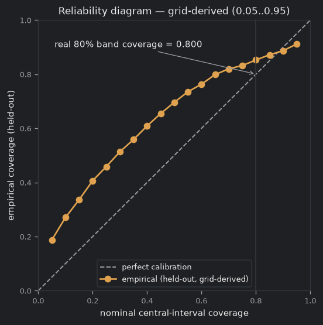
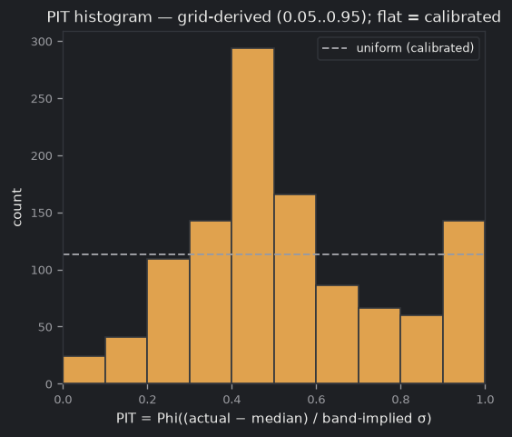
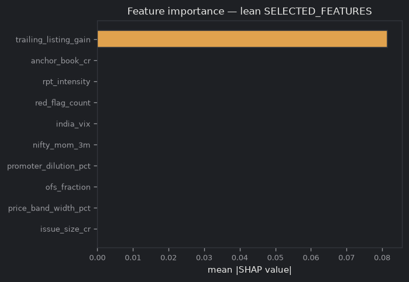

# DRHPLens — Listing-Day Forecaster Model Card

**Model version:** `cqr-xgb-live-2026.07`

## What this model is

A calibrated 80% prediction INTERVAL for the listing-day return of an Indian mainboard IPO, made at issue open (T0) — a range, not a call. It is informational and educational only, not advice. The grey-market premium is shown for context but NEVER feeds the model (GMP-free, FCAST-02).

## Training + backtest window

- **Training / backtest window:** 2014–2025 listing years — live NSE survivorship panel (1,378 IPOs, 5 withdrawn)
- **Scored (held-out, non-abstain) IPOs:** 1132
- **Protocol:** expanding-window, as-of-T0 walk-forward — for each IPO the train + calibration pool is STRICTLY the IPOs that listed before its issue date, so no future IPO can leak into training (P4/P6).

## Lean feature list (available_at ≤ T0)

The wide four-family candidate pool is curated to a lean production set (D5-07); every feature is disclosed at or before issue open, verified by the `available_at ≤ T0` leakage gate (FCAST-02).

| Feature | Family | available_at | Verdict |
|---|---|---|---|
| `issue_size_cr` | a | DRHP/RHP filing date (≤ T0) | <= T0 ✓ |
| `price_band_width_pct` | a | DRHP/RHP filing date (≤ T0) | <= T0 ✓ |
| `ofs_fraction` | a | DRHP/RHP filing date (≤ T0) | <= T0 ✓ |
| `promoter_dilution_pct` | a | DRHP/RHP filing date (≤ T0) | <= T0 ✓ |
| `nifty_mom_3m` | b | pre-open T0−1 EOD snapshot (< T0) | <= T0 ✓ |
| `india_vix` | b | pre-open T0−1 EOD snapshot (< T0) | <= T0 ✓ |
| `trailing_listing_gain` | b | pre-open T0−1 EOD snapshot (< T0) | <= T0 ✓ |
| `red_flag_count` | c | DRHP/RHP filing date (≤ T0) | <= T0 ✓ |
| `rpt_intensity` | c | DRHP/RHP filing date (≤ T0) | <= T0 ✓ |
| `anchor_book_cr` | d | pre-open T0−1 EOD snapshot (< T0) | <= T0 ✓ |

## Anchor pre-open leakage audit (D5-08)

Anchor-investor demand is the ONE legitimate T0 demand proxy, but it is borderline: only the PRE-OPEN anchor allocation (disclosed the day before issue open, T0−1) may be read. Post-open book-build demand (QIB / NII / RII, which closes AFTER issue open) can never be a feature.

| Anchor feature | Pre-open source | Disclosed | Verdict |
|---|---|---|---|
| `anchor_book_cr` | pre-open anchor allocation book size (₹ crore) | T0-1 | pre-open allocation only, <= T0 ✓ |
| `anchor_investor_quality` | pre-open anchor-investor quality/mix score | T0-1 | pre-open allocation only, <= T0 ✓ |
| `anchor_lockin_frac` | pre-open anchor lock-in fraction | T0-1 | pre-open allocation only, <= T0 ✓ |

## Baselines + Diebold–Mariano test (P9 release gate)

The model is compared against four naive baselines under the IDENTICAL as-of-T0 protocol — it is never given an easier evaluation. A Diebold–Mariano test (Harvey small-sample correction) on the MAE-loss differential gives the significance; a paired Wilcoxon signed-rank p is the distribution-free cross-check (A7).

| Baseline | DM stat | p-value | Wilcoxon p | n | Verdict |
|---|---|---|---|---|---|
| `predict_zero` | 0.206 | 0.837 | 0.072 | 1132 | tie — no significant difference |
| `global_median` | 5.471 | 0.000 | 0.000 | 1132 | baseline lower loss (DM p<0.05) |
| `trailing_12` | 4.327 | 0.000 | 0.000 | 1132 | baseline lower loss (DM p<0.05) |
| `sector_mean` | -17.073 | 0.000 | 0.000 | 1132 | model lower loss (DM p<0.05) |

**P9 release gate: FAIL.**

> RELEASE GATE FAILED (baseline beats model): the naive baseline(s) ['global_median', 'trailing_12'] significantly beat the model (Diebold–Mariano p<0.05 in the baseline's favor). The model adds nothing over a naive rule on this evaluation — do NOT ship it and do NOT p-hack features to force a pass.

> The model does not significantly outperform the following baseline(s) at p<0.05: ['predict_zero', 'global_median', 'trailing_12']. For a pre-apply, no-demand forecast this humble result is EXPECTED (D5-01) — a low R² is a feature, not a bug. The model card states this plainly; no features/folds/tests were tuned to cross the gate.

## Calibration, PIT + feature importance

## Held-out calibration metrics

- **80% interval coverage (empirical, held-out):** 0.800
- **Mean absolute error:** 0.43 points

| Listing year | RMSE (points) |
|---|---|
| 2003 | 0.06 |
| 2017 | 0.28 |
| 2018 | 0.19 |
| 2019 | 0.33 |
| 2020 | 0.35 |
| 2021 | 0.60 |
| 2022 | 0.41 |
| 2023 | 7.39 |
| 2024 | 0.86 |
| 2025 | 0.38 |
| 2026 | 0.62 |

## R² leakage alarm

- **Status: not fired.** Out-of-sample median R² = -0.010 ≤ 0.5. A humble R² is expected for a pre-apply, no-demand model (D5-01); a value above 0.5 would flag a T0-violating feature and fail the release gate.

## N per sector (D5-10)

Sectors with fewer than 30 IPOs are pooled into `Other` so a thin sector never becomes a noise-prone single-value slice; the ORIGINAL per-sector counts are kept below so the thinness stays visible.

| Sector | N |
|---|---|
| Automobiles (passenger vehicles) | 1 |
| Beauty and lifestyle e-commerce | 1 |
| Electric vehicles (two-wheelers) | 1 |
| FMCG / personal care (D2C) | 1 |
| Fintech / digital payments | 1 |
| Food delivery | 2 |
| Insurance | 1 |

## Known limitations

- **A humble R² is the honest result.** This is a pre-apply, no-demand forecast made at issue open (T0). It cannot see book-build demand, so a low out-of-sample R² is EXPECTED — a feature, not a bug (D5-01). A high R² (> 0.5) would instead flag a T0-violating feature leaking the future, so it is wired as a release-gate alarm.
- **Coverage is measured, not assumed.** The 80% interval coverage is the REAL held-out number over IPOs the model never trained on. It can land below or above 0.80 — the card shows the measured value, never a rounded-to-0.80 fiction (P17).
- **The PIT curve is grid-derived.** The reliability/PIT diagnostic fits a fine 0.05..0.95 quantile grid PURELY for the plot; the production interval stays the 0.1 / 0.5 / 0.9 band. The PIT is labelled grid-derived wherever it is shown (A8).
- **The Diebold–Mariano test is cross-sectional.** The four baselines are compared under the identical as-of-T0 protocol, but the loss differential is cross-sectional across IPOs rather than a single time series — read the DM p-values with that caveat (A7). A paired Wilcoxon signed-rank p is reported alongside as a distribution-free cross-check.
- **Live 05-11 backtest — the model does NOT beat naive baselines.** This card is the real live walk-forward over the 1,378-IPO survivorship panel (built 2026-07-25). The P9 release gate FAILED: global_median and trailing_12 beat the model (Diebold–Mariano p<1e-5). The forecaster is not presented as a validated model — the honest 'does-not-outperform' verdict is the result; no features/folds/tests were tuned to cross the gate (D5-01/P9).
- **SHAP plot pending real regeneration.** The calibration and PIT plots are regenerated from the real held-out run; the SHAP feature-importance plot (shap.png) is still the seed fixture and is illustrative only.

---

*Informational only — not advice. DRHPLens.*
